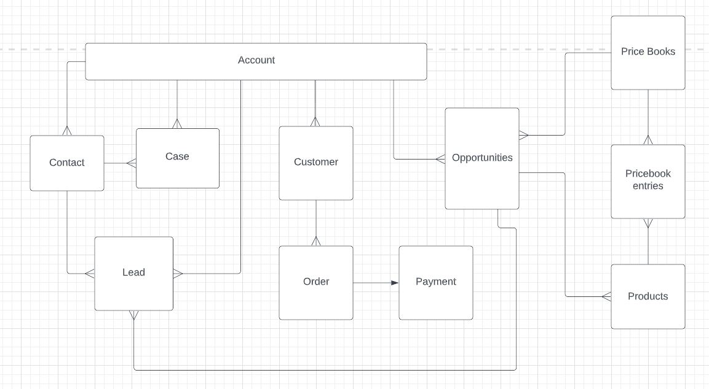

# Project 2
This project is an ecommerce game distributor called Mist. We work with Independent developers, publishers, and studios to bring games to everyone!

# ERD

# Technology Stack
* Apex
* VisualForce
* Salesforce Trailhead Playground

# Features
List of features ready and TODOs for future development
* Mist Store App
* Displayed Games(Products), Studios, and Publishers available to our store.
* Organization, Object, record, and field level security.
* A Games Wishlist 
* Visualforce pages to showcase Games, Publishers, Studios with, each with a featured list.
* Flows and triggers that increased productivity by creating wishlist items, generating records, creating tasks, and sending emails to notify when a high piority case is recived.

To-do list:
* Needs to rework the event, trigger, and flow for thumbs up notificaitons

# Contributors

* Alfred Do
* Chris Pavur
* Daniel Alcala
* Johnny Tran
* Mark Snyder
* Nam Phan

