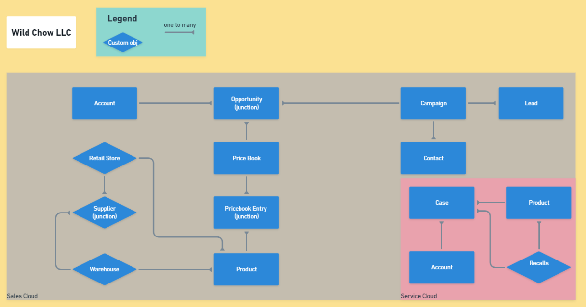

# Project 1

# An Animal Food Retailer!
A retail business that sells a varity of animal feed to all kinds of customers!

# ERD

# Technology Stack
* Salesforce Trailhead Playground

# Features
* Improved service cloud team member's case management with automation tools like queues, web-to-case, and implementing case assignemnt, escalation rules, with a load balancing formula.
* Featured security at the Organization, Object, record, and field levels.
* Utilized Sales Cloud tools such as auto-reponses, paths, and web-to-lead to incrase the sales team's productivity with lead management.
* Process automation tools like screen, auto-launched, before, and after save flows to cut down on reducdent work.

To-do list:
* Add more features to further imporve the business' productivity.

# Contributors
* Nam Phan

