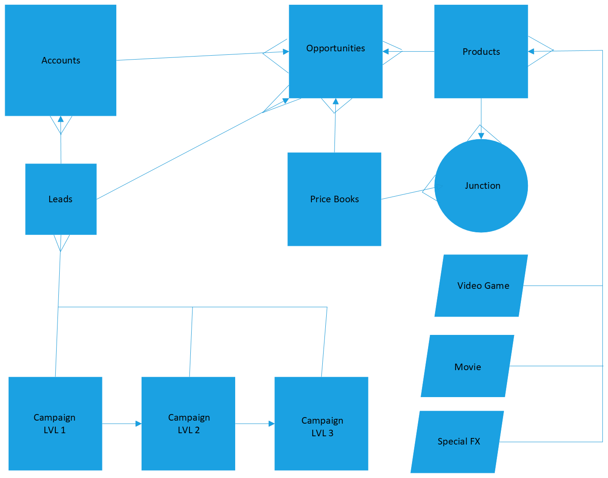

# Snyder Studios
Snyder Studios is video game and movie special effects company that is using Salesforce to track potential clients and ideas for projects, as well as tracking progress of current projects.

# ERD

# Technologies Used
* Salesforce Trailhead Playground
* All Declarative Tools

# Features
List of features ready and TODOs for future development

* Awesome feature 1
* Organization, object, record, and field level security.
* Awesome feature 3
To-do list:
* Needs to rework the event, trigger, and flow for thumbs up notifications

# Contributors

* Mark Snyder
