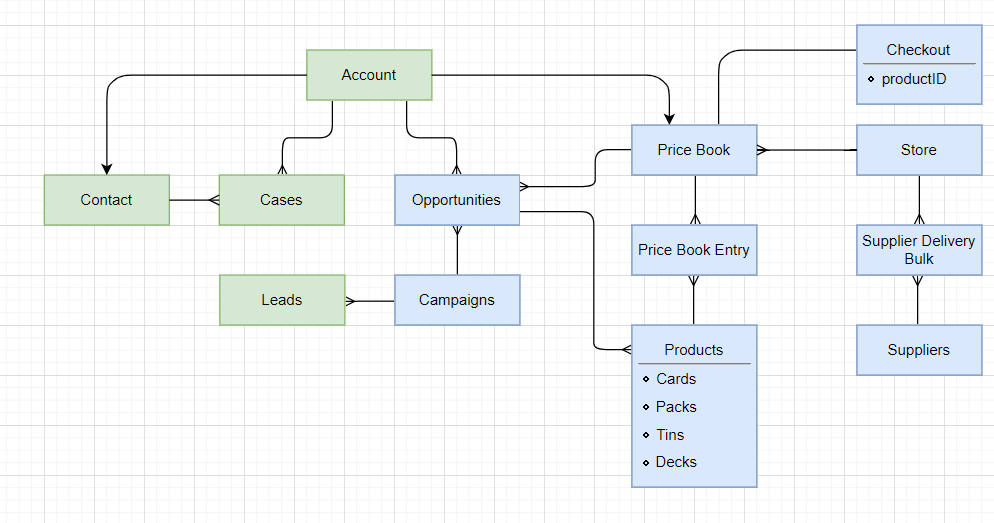

# Project 1
This project is a trading card shopping app called Johnny's Card Shop. The goal is to provide an alternative service to trading card game collectors as a vendor with self-established product marketing.

# ERD

# Technology Stack
* Salesforce Trailhead Playground

# Features
List of features ready and TODOs for future development
* Custom front page store app
* Displayed custom Products that sell random cards by rarity value, supplied by a list of partner suppliers.
* Organization, Object, record, and field level security.
* Create leads and cases via form submission from web or designated email address
* Flows that provide feedback interactivity on the front page, generate records, create tasks, and sends an email to confirm a successful deal closing.

To-do list:
* Expand on workflows and approval processes, utilize object-specific quick action and global quick action

# Contributor

* Johnny Tran

